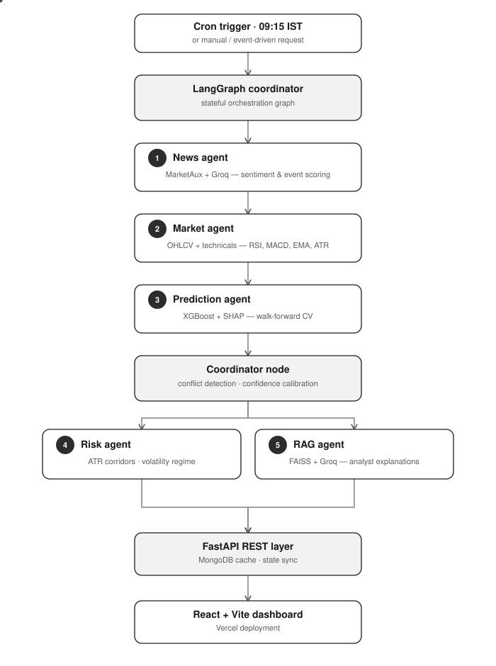

# MarketDrive AI
> **Multi-Agent Financial Intelligence & Short-Term Equity Forecasting System**

MarketDrive AI is an autonomous, multi-agent financial research system built for NSE (Indian Stock Market) top equities. It orchestrates 6 specialized AI agents using **LangGraph** to process technical market data, institutional news sentiment, machine learning feature importances, and risk management guidelines into actionable, explainable short-term predictions.

Live Demo → [market-drive-ai.vercel.app](https://market-drive-ai.vercel.app) · API → [marketdrive-backend.onrender.com](https://marketdrive-backend.onrender.com)

---

## System Architecture & Agent Flow



---

## Multi-Agent Roles

### 1. News Agent
- Fetches live financial headlines from **MarketAux API** with relevance and recency filtering.
- Applies exponential time-decay freshness scoring.
- Uses **Groq (Llama 3)** to extract structured sentiment scores (−1.0 to +1.0), event impact scores, dominant event classification, and narrative consistency checks.

### 2. Market Agent
- Ingests 12-month historical OHLCV data from **Yahoo Finance (yfinance)**.
- Computes a comprehensive technical indicator stack: **RSI, MACD, EMA 20/50/200, ATR, Volume Ratio, VWAP**.
- Evaluates macro market trends (Nifty, BankNifty, Sensex) and detects volume spikes and Support/Resistance breakouts.

### 3. Prediction Agent
- Runs live inference using per-stock **XGBoost classifiers** trained with walk-forward cross-validation.
- Dynamically labels training targets based on intraday returns `(Close − Open) / Open` with a balanced 1% threshold.
- Generates **SHAP feature importances** for every prediction, providing full model interpretability.

### 4. Coordinator Node
- Detects cross-signal conflicts (e.g. negative news vs. bullish technicals).
- Dynamically adjusts model confidence based on signal agreement (clamped 10%–95%).
- Monitors mid-session event triggers to initiate re-prediction sweeps automatically.

### 5. Risk Agent
- Classifies the current volatility regime (Low / Medium / High) based on ATR percentile.
- Generates ATR-based stop-loss and target price corridors, and provides position sizing guidance.

### 6. RAG Agent (Retrieval-Augmented Generation)
- Stores prediction history and semantic embeddings using **FAISS** (in-memory vector DB).
- Generates human-readable analyst-style explanations using **Groq LLM** via RAG prompts.
- Manages daily model retraining log storage and API rate limit tracking.

---

## Tech Stack

| Layer | Technology | Purpose |
|---|---|---|
| Orchestration | LangGraph | Stateful multi-agent graph with conditional routing |
| LLM Engine | Groq (Llama 3) | Sub-second inference for sentiment & RAG explanations |
| ML Model | XGBoost + SHAP | Intraday direction prediction with walk-forward CV |
| Market Data | yfinance + pandas_ta | OHLCV ingestion and technical indicator computation |
| News API | MarketAux | Live financial headline fetching |
| State Layer | MongoDB Atlas | Persistent cloud state sync for ephemeral hosts |
| Backend API | FastAPI + Uvicorn | Async REST server and scheduled prediction orchestration |
| Frontend UI | React 19 + Vite | Minimalist high-contrast analytics dashboard |
| Hosting | Render + Vercel | Backend and frontend cloud deployment |

---

## Key Design Decisions

### Why Groq?

Financial news sentiment processing must complete before market open (09:15 AM IST). Groq's LPU hardware delivers Llama 3 completions in under 200ms per call — fast enough to process 5 stocks × multiple headlines in parallel without blocking the LangGraph pipeline. It also enforces strict JSON output schemas, eliminating fragile regex parsing of LLM responses.

### Why MongoDB for State?

Cloud deployment platforms like Render run on **ephemeral file systems** — every service restart wipes local disk state, including:

- Trained XGBoost model files (`.pkl`)
- FAISS vector index files
- JSON prediction caches
- Retraining logs

A custom sync layer (`db_sync.py`) serializes all local state files, encodes binary models in Base64, and syncs them bidirectionally with **MongoDB Atlas** on every startup and after every retraining cycle. This gives the backend persistent memory across restarts with no data loss.

---

## Local Development

### Backend

```bash
cd backend
python -m venv venv

# Activate (Windows PowerShell)
.\venv\Scripts\Activate.ps1

# Install
pip install -r requirements.txt

# Configure environment
cp .env.example .env
# Fill: GROQ_API_KEY, MARKETAUX_API_KEY, MONGODB_URI

# Run
uvicorn main:app --reload
```

### Frontend

```bash
cd frontend
npm install
npm run dev
```

---

## Environment Variables

```bash
# Backend (.env)
GROQ_API_KEY=
MARKETAUX_API_KEY=
MONGODB_URI=
```

---

## Deployment

| Service | Platform | Config |
|---|---|---|
| Backend API | Render (Python Web Service) | `render.yaml` |
| Frontend UI | Vercel (Static SPA) | Auto-detected Vite project |
| Scheduled Jobs | GitHub Actions | `.github/workflows/` |

GitHub Actions wakes up the Render backend during IST market hours (free tier spin-up mitigation) and triggers the daily prediction + retraining sweep automatically.

---

## Covered Stocks

| Company | NSE Ticker | Training Data Years | Reason for Training Window |
|---|---|---|---|
| Infosys | INFY.NS | Jan 2020 – Dec 2022 | Captures the COVID-19 crash & IT sector rebound (2020), the post-pandemic tech supercycle and INFY revenue beats (2021), and the global rate-hike-driven IT correction (2022). This 3-year window gives the model a full bull-bear cycle specific to large-cap Indian IT. |
| Vodafone Idea | IDEA.NS | Jan 2019 – Dec 2021 | Covers the AGR dues crisis verdict (2019) that pushed IDEA to near-insolvency, the subsequent debt restructuring negotiations (2020), and the government equity conversion rescue (2021). This is the most structurally volatile period for the stock — the model learns extreme distress-driven intraday patterns. |
| Tata Motors | TATAMOTORS.NS | Jan 2021 – Dec 2023 | Captures the global semiconductor chip shortage impact on JLR (2021), the EV pivot and Tata.ev brand launch momentum (2022), and the JLR order-book recovery and margin expansion cycle (2023). Avoids pre-COVID years where JLR losses dominated and the signal regime is unrepresentative of current business fundamentals. |
| Adani Enterprises | ADANIENT.NS | Jan 2021 – Dec 2023 | Covers the flagship FPO run-up and the Hindenburg Research short-seller attack crash (Jan 2023) — the single largest intraday volatility event in Adani's history. Including this period forces the model to learn high-conviction reversal and panic-selling patterns. Pre-2021 data has low liquidity and thin volume, making technical signals unreliable. |
| Yes Bank | YESBANK.NS | Jan 2018 – Dec 2020 | Covers the RBI-forced CEO removal and governance collapse (2018–2019), the moratorium freeze and SBI-led rescue restructuring (March 2020), and the post-bailout stabilisation. This is the only window where Yes Bank exhibits meaningful directional intraday movement; post-2020 the stock trades in a compressed ₹12–25 band with low signal-to-noise. |

---

*Built by [Mohan](https://www.linkedin.com/in/mohansuraboina2104)*
